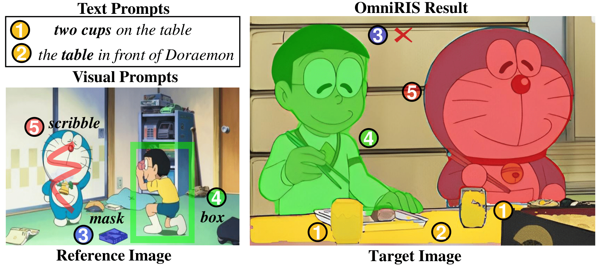
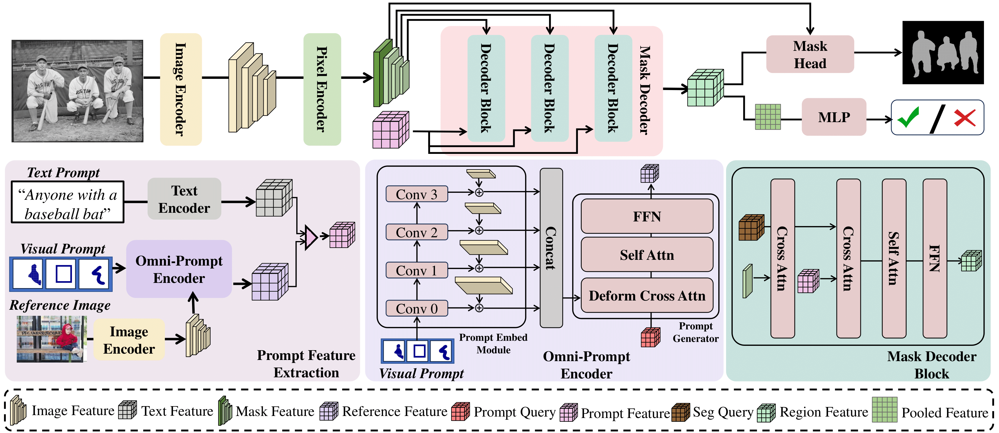
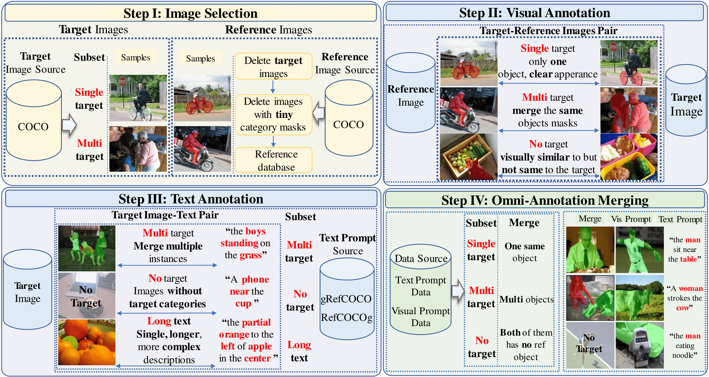

# Omni-Referring Image Segmentation

**Authors:**
Qiancheng Zheng*¹, Yunhang Shen*², Gen Luo³, Baiyang Song¹, Xing Sun², Xiaoshuai Sun¹, Yiyi Zhou¹, Rongrong Ji¹

¹ Key Laboratory of Multimedia Trusted Perception and Efficient Computing, Ministry of Education of China, Xiamen University
² Youtu Lab, Tencent
³ OpenGVLab, Shanghai AI Laboratory

[**📄 Paper (arXiv)**](https://arxiv.org/abs/2512.06862) | [**💻 Code **](https://github.com/As-Time-Goes-By/OmniSegNet) | [**💾 Dataset**](https://huggingface.co/datasets/TUZKI/OmniRef)

---



## Abstract

In this paper, we propose a novel task termed Omni-Referring Image Segmentation (OmniRIS) towards highly generalized image segmentation. Compared with existing unimodally conditioned segmentation tasks, such as RIS and visual RIS, OmniRIS supports the input of text instructions and reference images with masks, boxes or scribbles as omni-prompts. This property makes it can well exploit the intrinsic merits of both text and visual modalities, i.e., granular attribute referring and uncommon object grounding, respectively. Besides, OmniRIS can also handle various segmentation settings, such as one v.s. many and many v.s. many, further facilitating its practical use. To promote the research of OmniRIS, we also rigorously design and construct a large dataset termed OmniRef, which consists of 186,939 omni-prompts for 30,956 images, and establish a comprehensive evaluation system. Moreover, a strong and general baseline termed OmniSegNet is also proposed to tackle the key challenges of OmniRIS, such as omni-prompt encoding. The extensive experiments not only validate the capability of OmniSegNet in following omni-modal instructions, but also show the superiority of OmniRIS for highly generalized image segmentation. 

---

## OmniSegNet Architecture

We propose a strong baseline, **OmniSegNet**, equipped with a novel Omni-Prompt Encoder to handle multi-modal inputs and a specific training regime for complex segmentation settings.




---

## OmniRef Dataset

### A Large-Scale Benchmark
*   **186,939** omni-prompts
*   **30,956** images
*   Includes **Text**, **Mask**, **Box**, and **Scribble** prompts.

The dataset covers diverse scenarios including single-target, multi-target, and no-target, providing a rigorous testbed for generalized segmentation.

### Distribution of Segmentation Scenarios (in Thousands)
*   **One vs. Many:** 69.5
*   **One vs. One:** 59.9
*   **No-Target:** 36.9
*   **Many vs. Many:** 16.1
*   **Many vs. One:** 4.5

---

## Qualitative Results

Visualization of OmniSegNet on unseen visual instances and complex text instructions. The results demonstrate the model's capability to handle One vs Many, Text Prompts, Visual Prompts, and No-Target scenarios effectively.


## Citation

```bibtex
@article{zheng2025omniris,
  title={Omni-Referring Image Segmentation},
  author={Zheng, Qiancheng and Shen, Yunhang and Luo, Gen and Song, Baiyang and Sun, Xing and Sun, Xiaoshuai and Zhou, Yiyi and Ji, Rongrong},
  journal={arXiv preprint arXiv:2512.06862},
  year={2025}
}
